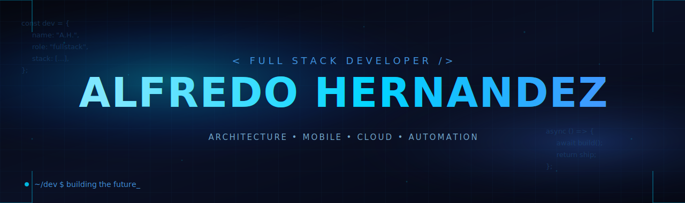

  

# Alfredo Hernández

Software architect and full-stack developer focused on enterprise systems, cross-platform mobile applications, and digital commerce infrastructure. Passionate about clean architecture, thoughtful design, and the intersection between technology and real-world operations.

---

### Technical Stack

| Category | Technologies |
| :--- | :--- |
| **Languages** | JavaScript (ES6+), Dart, Python, SQL |
| **Frameworks** | Flutter, Odoo Framework, Node.js |
| **Backend & Cloud** | PostgreSQL, Supabase, Firebase |
| **Workflow & Tooling** | Git, Docker, Linear, Pop!_OS |
| **Design Language** | iOS-inspired aesthetics, translucent UI, frosted glass effects |

---

### Current Focus

- **Enterprise Solutions:** Designing, developing, and customizing advanced modules within the Odoo ecosystem for ERP, sales, and logistics.
- **Mobile Ecosystems:** Architecting performant cross-platform applications with Flutter, emphasizing refined user experience and maintainable codebases.
- **Digital Commerce:** Implementing end-to-end sales and fulfillment infrastructure that bridges operations, inventory, and customer experience.

---

### Development & Collaboration

- Integrating **AI-assisted workflows** (Gemini, Claude) into local development and automation pipelines.
- Exploring **AgroTech** initiatives and industrial process automation as a bridge between traditional industries and modern software.
- Specialized in software architecture, product development, and workflow optimization across the full delivery lifecycle.
- Open to collaboration on ambitious projects involving ERP customization, mobile platforms, or automation systems.

---

### Contact

- **LinkedIn:** [Alfredo Hernández](https://www.linkedin.com/in/alfredo-hern%C3%A1ndez-hern%C3%A1ndez-356728334?utm_source=share&utm_campaign=share_via&utm_content=profile&utm_medium=android_app)
- **Email:** [freddy1104hh@gmail.com](mailto:freddy1104hh@gmail.com)

---
